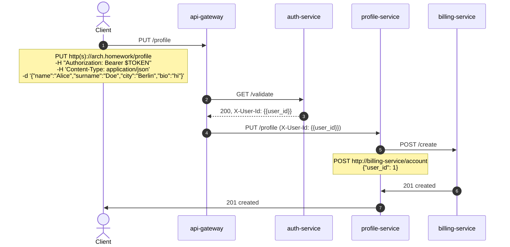
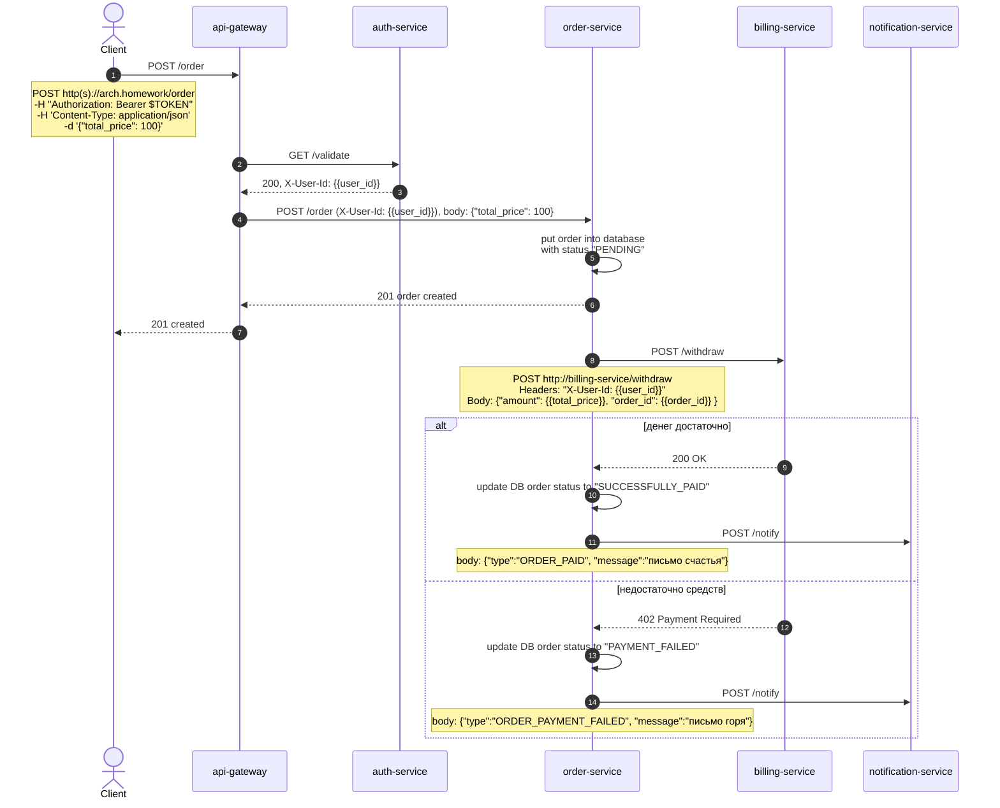
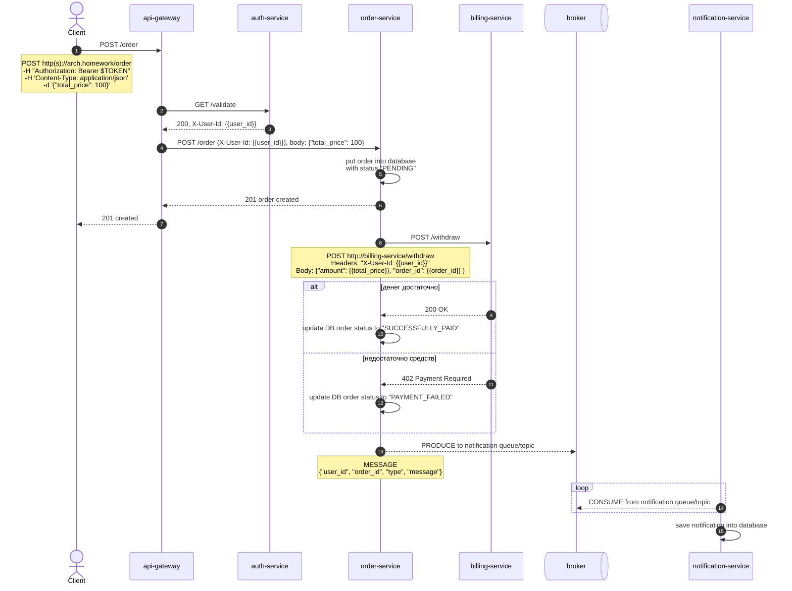
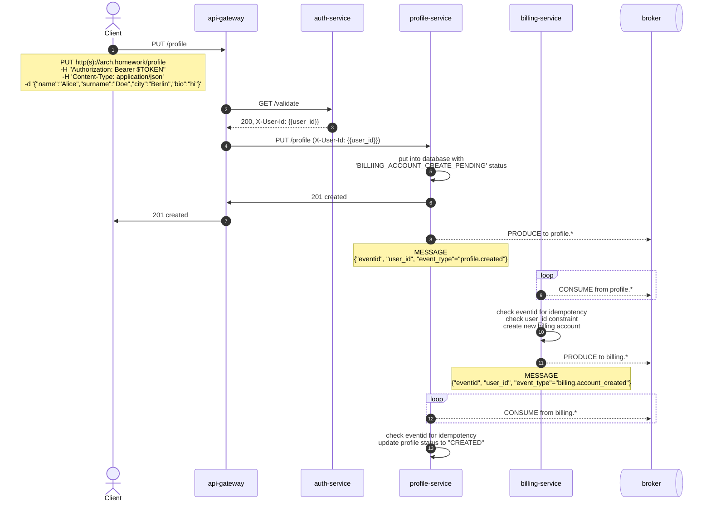
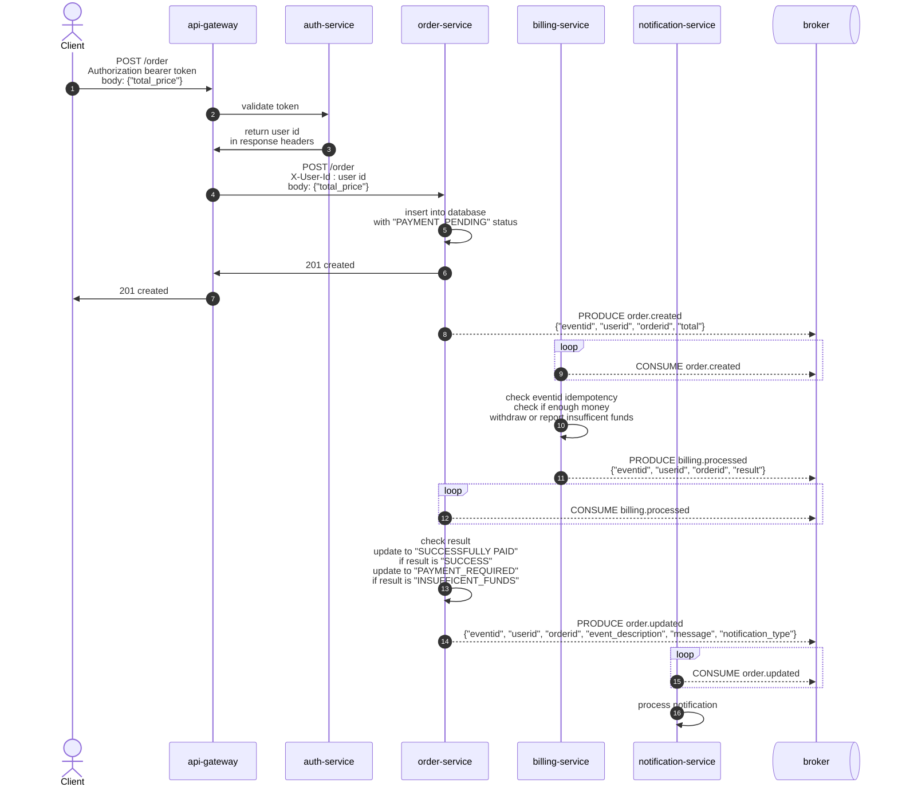

# Проектирование взаимодействия сервисов при создании заказа

## Спецификации API

### OpenAPI (HTTP)
| Сервис | Файл |
|--------|------|
| auth-service         | [auth-openapi-spec.yaml](./openapi/auth-openapi-spec.yaml) |
| profile-service      | [profile-openapi-spec.yaml](./openapi/profile-openapi-spec.yaml) |
| order-service        | [order-openapi-spec.yaml](./openapi/order-openapi-spec.yaml) |
| billing-service      | [billing-openapi-spec.yaml](./openapi/billing-openapi-spec.yaml) |
| notification-service | [notification-openapi-spec.yaml](./openapi/notification-openapi-spec.yaml) |

### AsyncAPI (брокер сообщений)
| Сервис | Файл |
|--------|------|
| profile-service      | [profile-async-api-spec.yaml](./async-api/profile-async-api-spec.yaml) |
| order-service        | [order-async-api-spec.yaml](./async-api/order-async-api-spec.yaml) |
| billing-service      | [billing-async-api-spec.yaml](./async-api/billing-async-api-spec.yaml) |
| notification-service | [notification-async-api-spec.yaml](./async-api/notification-async-api-spec.yaml) |

---

## Вариант 1 - только HTTP взаимодействие

### Создание профиля


### Создание заказа



## Вариант 2 - событийное взаимодействие с использованием брокера сообщений для нотификаций (уведомлений)
### Создание заказа



## Вариант 3 - Event Collaboration cтиль взаимодействия с использованием брокера сообщений

### Создание профиля


### Создание заказа


---

## Наиболее адекватный вариант для данной задачи

**Выбран: Вариант 3 — Event Collaboration через брокер сообщений.**

### Почему не вариант 1 (HTTP-only)
- Жёсткая связность: `order-service` должен знать про `billing` и `notification` и быть доступным к каждому из них в момент обработки заказа.
- Нет естественной устойчивости к временной недоступности контрагентов — нужны retry/circuit-breaker в каждом вызове.
- Сложно добавлять новых подписчиков на факт создания/оплаты заказа — каждый такой потребитель требует изменения кода `order-service`.

### Почему не вариант 2 (HTTP + брокер только для нотификаций)
- Гибридная модель: часть связей синхронная, часть асинхронная — сложнее в эксплуатации и отладке.
- Основной flow создания заказа всё ещё синхронный — если `billing` недоступен, заказ не создаётся.
- Существенные архитектурные проблемы варианта 1 остаются.

### Почему вариант 3
- **Слабая связность:** `order-service` публикует факт создания заказа и не знает, кто его обработает.
- **Устойчивость к сбоям:** кратковременная недоступность `billing` или `notification` не ломает создание заказа — сообщения остаются в брокере.
- **Ответ клиенту быстрый:** 201 возвращается сразу после сохранения в БД со статусом `PAYMENT_PENDING`.
- **Расширяемость:** новые потребители (аналитика, склад, CRM) подключаются к `order.created`/`order.updated` без изменения `order-service`.
- **Единообразный стиль:** тот же подход используется и при создании профиля (см. выше), что упрощает эксплуатацию.

### На что обратить внимание при реализации
- **Идемпотентность** потребителей (проверка `eventid`) — брокер может доставлять сообщения повторно (at-least-once).
- **Transactional outbox** в продюсерах чтобы гарантировать: запись в БД и отправка в брокер — атомарны.
- **Eventual consistency:** клиент видит заказ с `PAYMENT_PENDING` и получает финальный статус через нотификацию или повторным GET.
- **Schema Registry / версионирование событий** — контракты `order.*`, `billing.*`, `profile.*` зафиксированы в AsyncAPI спецификациях выше.


## Реализация

### Сервис заказов

- [`https://github.com/n-mark/order-svc`](https://github.com/n-mark/order-svc)
- [`dockerhub: mblkuta/ordersvc:0.1.0`](https://hub.docker.com/repository/docker/mblkuta/ordersvc/tags/0.1.0/)


### Сервис биллинга

- [`https://github.com/n-mark/billing-svc`](https://github.com/n-mark/billing-svc)
- [`dockerhub: mblkuta/billingsvc:0.1.2`](https://hub.docker.com/repository/docker/mblkuta/billingsvc/tags/0.1.2/)

### Сервис нотификаций

- [`https://github.com/n-mark/notificationsvc`](https://github.com/n-mark/notificationsvc)
- [`dockerhub: mblkuta/notificationsvc:0.1.0`](https://hub.docker.com/repository/docker/mblkuta/notificationsvc/tags/0.1.0/)

### Сервис профилей (новая версия, вынесен в отдельный репозиторий)

- [`https://github.com/n-mark/profilesvc`](https://github.com/n-mark/profilesvc)
- [`dockerhub: mblkuta/profile-service:0.2.0`](https://hub.docker.com/repository/docker/mblkuta/profile-service/tags/0.2.0/)

В качестве брокера сообщений используется RabbitMQ. Однако за счет использования интерфейсов в сервисах в дальшнейшем возможно сделать реализации и для других брокеров сообщений

## Helm-чарт

Для установки приложения в kubernetes кластер выполните команду (namespace: arch-hw)

```bash
helm install arch-hw ./helm/arch-homework
```

## Тесты 

postman-скрипт доступен в директории `tests/postman`
Описание и инструкция по запуску находятся в [`tests/postman/README.md`](tests/postman/README.md)