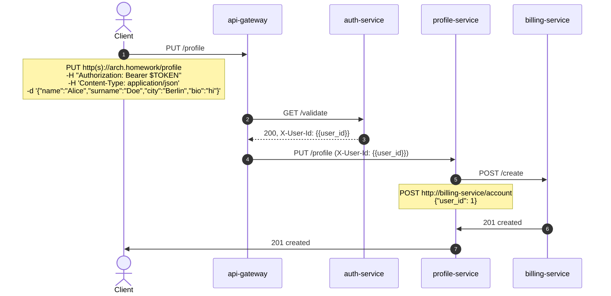
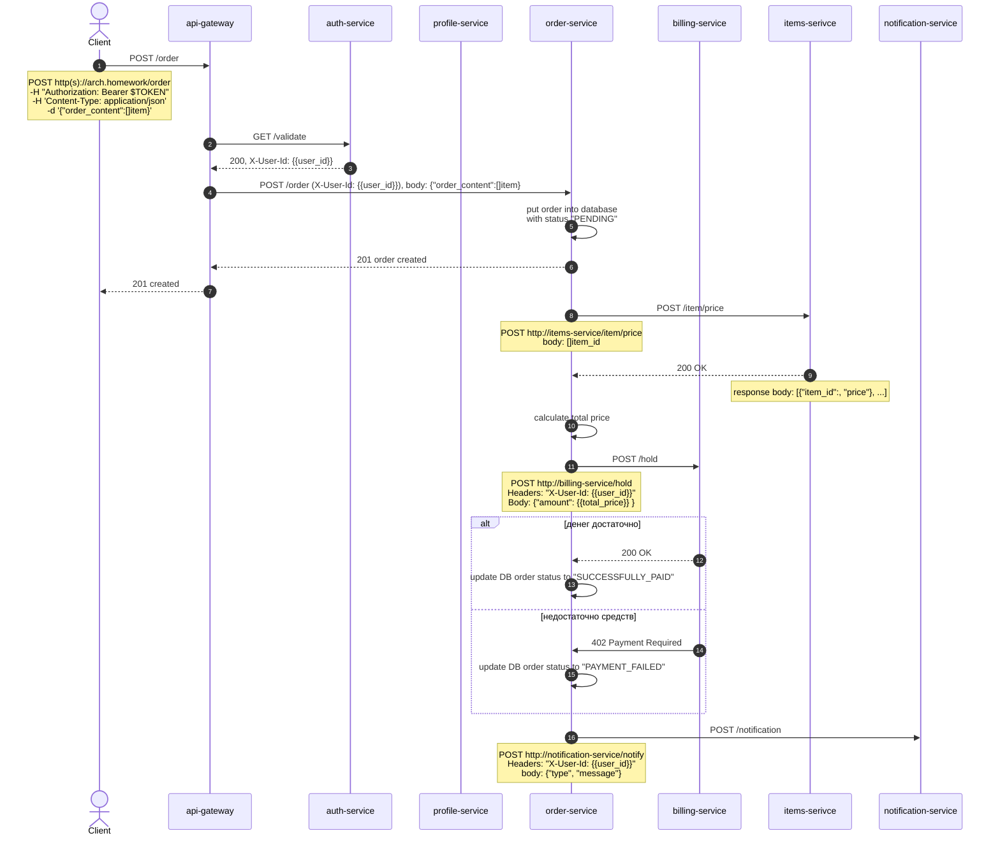
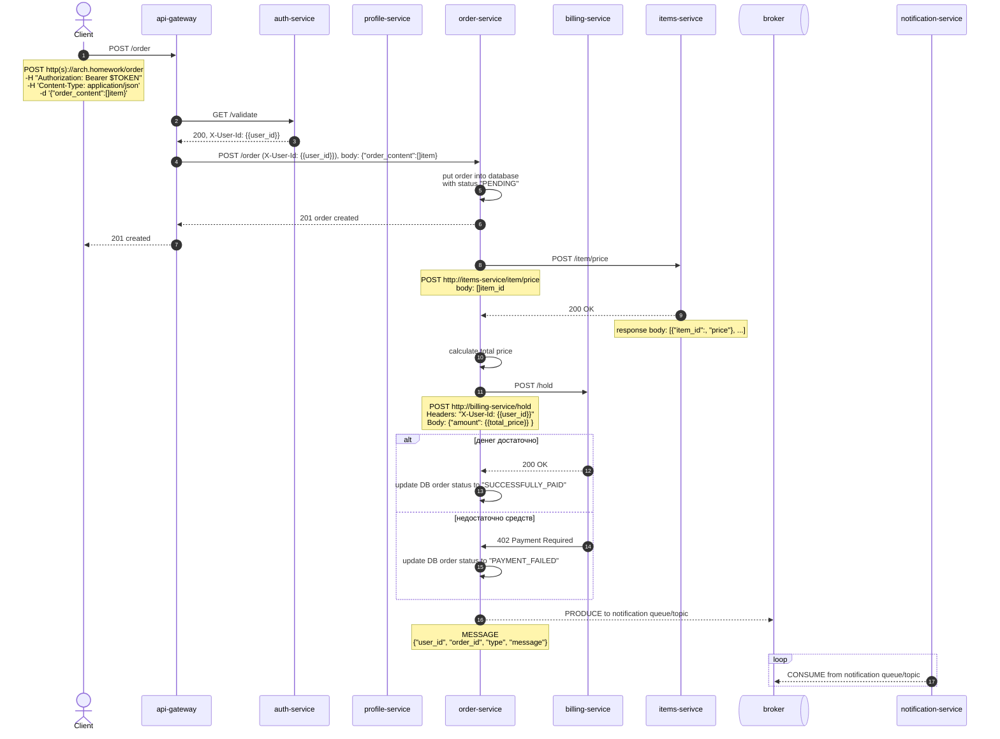
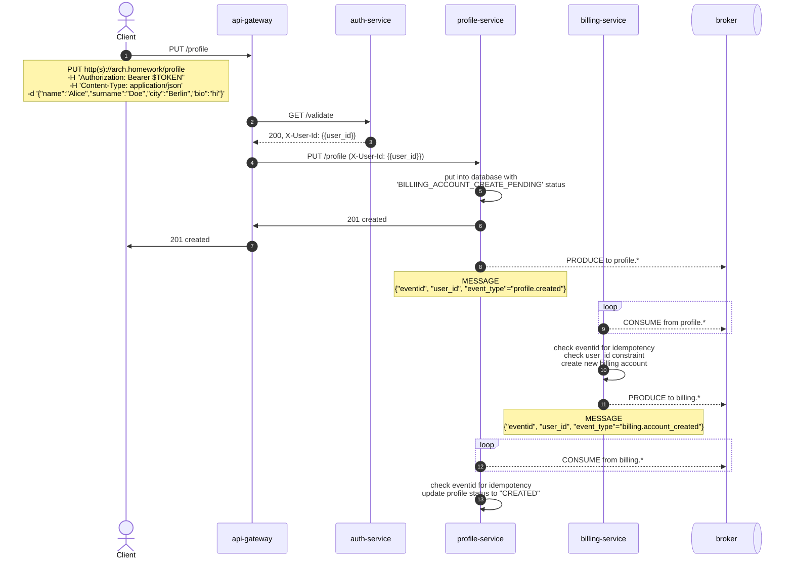
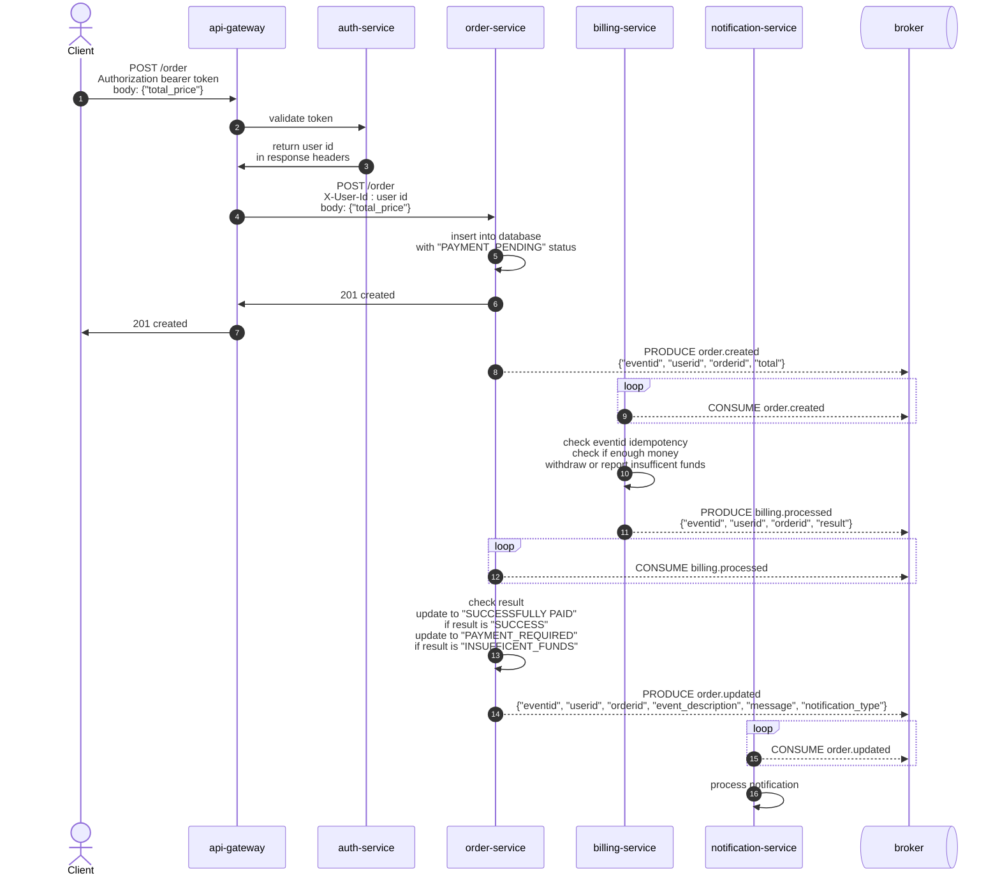

## Вариант 1 - только HTTP взаимодействие

### Создание профиля

### Создание заказа

## Вариант 2 - событийное взаимодействие с использованием брокера сообщений для нотификаций (уведомлений)
### Создание заказа

## Вариант 3 - Event Collaboration cтиль взаимодействия с использованием брокера сообщений

### Создание профиля

### Создание заказа
